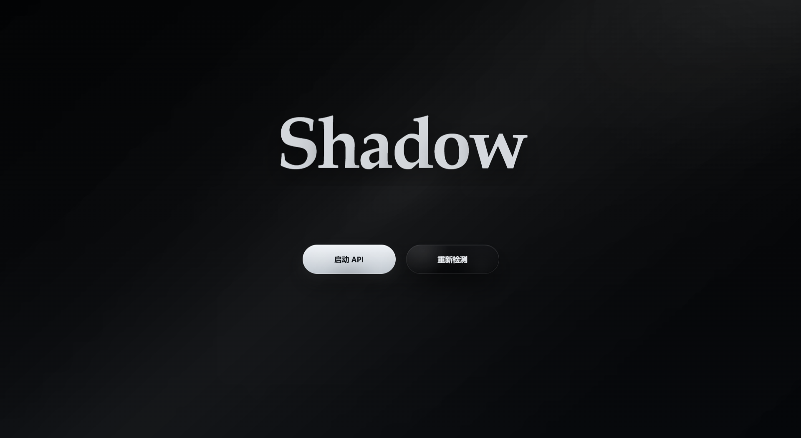
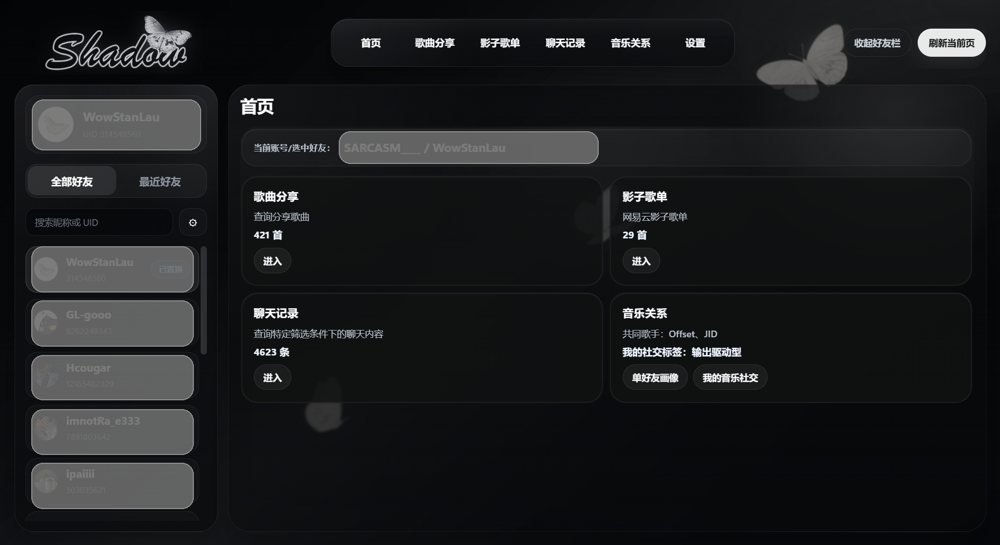
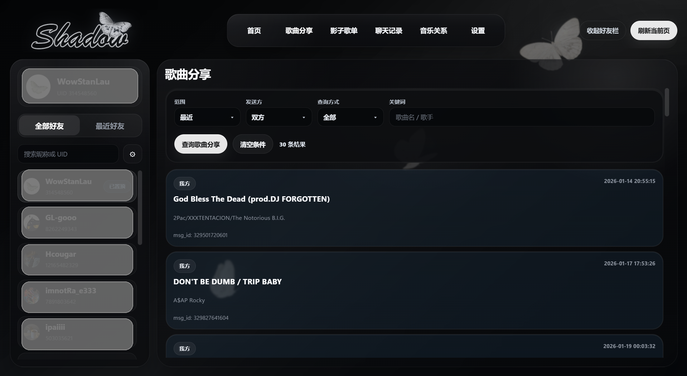
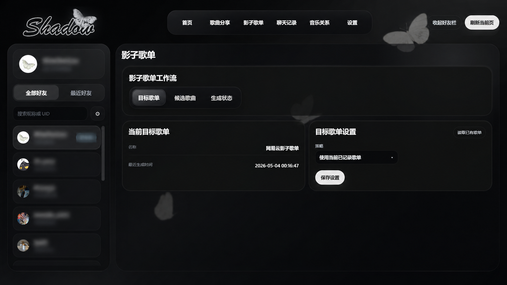
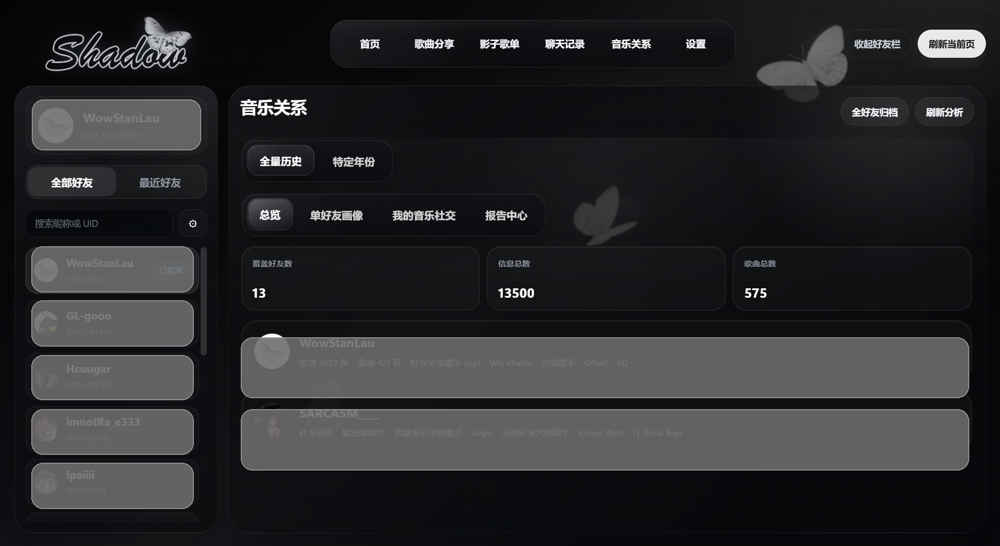

# Shadow V5

一个基于 `PySide6 + QWebEngineView + Web UI` 的网易云音乐桌面工具，用来整理聊天里的歌曲分享、生成影子歌单，并把好友之间的音乐互动做成可读的数据分析。

## 项目简介

Shadow V5 主要围绕“网易云私信里的音乐社交痕迹”展开。它把聊天记录、歌曲分享、目标歌单和关系分析串成一套桌面工作流，让用户可以更直观地查看：

- 和某位好友分享过哪些歌
- 某段时间里聊过什么、发过什么
- 如何把聊天里的候选歌曲整理成影子歌单
- 单好友画像和“我的音乐社交”整体分析结果

## 核心功能

- `歌曲分享`：按筛选范围提取当前好友私信里的歌曲记录。
- `影子歌单`：把候选歌曲整理后写入目标歌单。
- `聊天记录`：按范围查询聊天内容并返回结构化结果。
- `音乐关系`：生成单好友画像、我的音乐社交分析和报告内容。
- `设置`：查看 API、Cookie、目标歌单与 AI 文段设置状态。

## 界面预览

建议把公开展示截图统一放到 `docs/screenshots/`，README 直接引用这些图。

推荐首屏展示顺序：

1. `startup-login.png`
   登录页开场、光束氛围、二维码登录场景。
2. `home-overview.png`
   主页整体构图，能看出黑底、光束、蝴蝶和主功能区。
3. `song-share.png`
   歌曲分享结果区，体现聊天歌曲提取能力。
4. `shadow-playlist.png`
   影子歌单工作流，体现候选歌曲到目标歌单的过程。
5. `music-relation.png`
   音乐关系分析页，体现项目最有辨识度的数据内容。

截图目录建议：

```text
docs/
└─ screenshots/
   ├─ startup-login.png
   ├─ home-overview.png
   ├─ song-share.png
   ├─ shadow-playlist.png
   └─ music-relation.png
```

等你把图片放进去后，可以直接补成：

```md





```

## 技术栈

- 桌面端：`PySide6`
- Web 容器：`QWebEngineView`
- 前端：`Vite + React + TypeScript`
- 数据请求：`requests`
- 二维码生成：`qrcode[pil]`

## 项目结构

```text
V5/
├─ core/        桌面启动、状态编排、运行时路径
├─ services/    数据解析、分析、报告、歌单与 API 服务
├─ ui/          Qt 窗口与 Web bridge
├─ web/         Web UI、启动页、主页与功能区前端
├─ test/        Python 单元测试
├─ docs/        发布与公开仓库说明
└─ tools/       打包与内部辅助脚本
```

## 本地开发

### 1. 安装 Python 依赖

```powershell
pip install -r requirements.txt
```

### 2. 安装并构建前端

```powershell
cd web
npm install
npm run build
cd ..
```

### 3. 启动桌面程序

```powershell
python .\main.py
```

## 便携版说明

- 打包后，程序会以 `Shadow.exe` 所在目录作为运行根目录。
- `config.json`、缓存、归档、报告、临时文件都会写在当前解压目录内部。
- 删除整个解压目录即可清理程序运行产生的全部内容。

## 隐私与公开仓库说明

- 不要提交 `config.json`、`data/`、`build/`、`dist/`、`release/`、`runtime/`、`web/node_modules/`。
- 不要提交任何 Cookie、AI Key、聊天数据库、缓存、报告和二维码登录数据。
- 公开前请先阅读 [docs/GITHUB_PUBLIC_CHECKLIST.md](docs/GITHUB_PUBLIC_CHECKLIST.md)。

## 发布

- 便携版构建与打包流程见 [RELEASE_GUIDE.md](RELEASE_GUIDE.md)。
