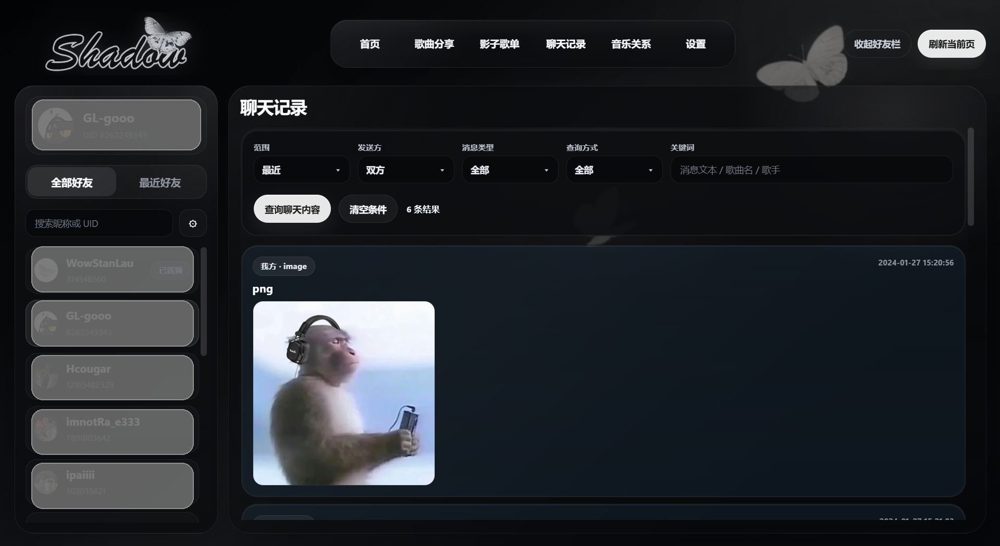

# Shadow V5

一款围绕网易云私信场景整理音乐社交内容的桌面工具。  
它把歌曲分享、聊天记录、影子歌单和音乐关系分析整理到同一套界面里，用更直观的方式回看你和好友之间的音乐互动。

## 产品概览

Shadow V5 主要处理四类内容：

- `歌曲分享`：提取你和当前好友私信中出现过的歌曲记录。
- `影子歌单`：把候选歌曲整理后写入目标歌单。
- `聊天记录`：按范围查看聊天内容和消息归档结果。
- `音乐关系`：生成单好友关系分析与“我的音乐社交”整体分析。

整个界面以黑色背景、斜向光束和蝴蝶元素构成统一视觉，登录页和主页属于同一个场景体系。

## 启动方式

### 便携版

- 解压后直接双击 `Shadow.exe` 即可启动。
- 便携版已经内置 `NeteaseCloudMusicApi` 运行时，不需要再单独打开终端安装 `Node.js`、`npm` 或 `NeteaseCloudMusicApi`。
- 程序首次运行会在当前目录生成 `config.json`，后续配置、缓存、归档和报告也都会写在当前目录内部。

### 源码运行

如果运行的是源码而不是便携版：

1. 安装 Python 依赖
2. 构建前端资源
3. 运行 `python .\main.py`
4. 如果本地没有内置 API 运行时，需要本机已安装 `Node.js`

```powershell
pip install -r requirements.txt
cd web
npm install
npm run build
cd ..
python .\main.py
```

## 登录与进入

程序启动后会先进入登录页。

- 点击 `启动 API` 后，程序会拉起本地 API 并检测当前 Cookie 状态。
- 如果 Cookie 为空或失效，会在按钮下方出现网易云二维码，扫码后即可更新登录状态。
- 如果 API 和 Cookie 都有效，程序会完成检测后直接进入主页。
- `重新检测` 只重新检查当前状态，不会清空已有内容。

## 功能说明

### 首页

首页用于展示当前账号、当前选中好友以及四个主功能入口：

- 歌曲分享
- 影子歌单
- 聊天记录
- 音乐关系

这是主流程的总览页，用来快速进入具体功能区。

### 歌曲分享

歌曲分享页用于读取你和当前好友私信里的歌曲记录，并支持按条件筛选：

- 范围
- 发送方
- 查询方式
- 关键词

结果区会按消息时间返回歌曲名称、歌手和消息信息。

### 影子歌单

影子歌单页分为三个工作区：

- `目标歌单`
  显示当前写入目标，以及最近一次生成时间。
- `候选歌曲`
  从聊天中的歌曲记录里筛出待生成内容。
- `生成状态`
  用来查看本次写入结果与当前歌单状态。

该功能会围绕你设置的目标歌单工作，因此更适合用来沉淀聊天里的共享音乐痕迹。

### 聊天记录

聊天记录页用于按范围查看与当前好友的聊天归档内容。  
除了普通文本，也会保留歌曲消息等结构化记录，方便后续继续分析和筛选。

### 音乐关系

音乐关系页用于查看更偏分析向的结果，主要包括：

- 单好友画像
- 我的音乐社交
- 关系节律时间线
- 报告与本地文段总结

它更像是整个项目的分析层，用来整理互动密度、歌曲分布、节律变化和社交结构。

### 设置

设置页用于查看和管理：

- API 当前状态
- Cookie 当前状态
- 二维码登录
- 目标歌单设置
- AI 文段设置

如果未填写有效 AI 配置，音乐关系里的文段会使用本地模板生成；填写有效配置后，相关分析会走你填写的 AI 服务。

## 数据写入位置

程序运行过程中产生的内容都会写入当前目录内部，包括：

- `config.json`
- `data/cache`
- `data/archive`
- `data/reports`
- `data/tmp`

如果不再使用，直接删除整个程序文件夹即可一并清理。

## 技术结构

- 桌面端：`PySide6`
- Web 容器：`QWebEngineView`
- 前端：`Vite + React + TypeScript`
- 数据请求：`requests`
- 二维码生成：`qrcode[pil]`

## 运行依赖

当前 Python 依赖：

```text
PySide6>=6.11
requests>=2.31
qrcode[pil]>=7.4
```

## 发布包
如果你是普通使用者，优先下载便携版即可，不需要再额外配置终端环境。
Windows 便携版请前往 [Releases](https://github.com/3061084478/Neateasecloudmusic_shadow_playlist/releases) 下载。
Windows 便携版压缩包会包含可直接启动的 `Shadow.exe`。  
